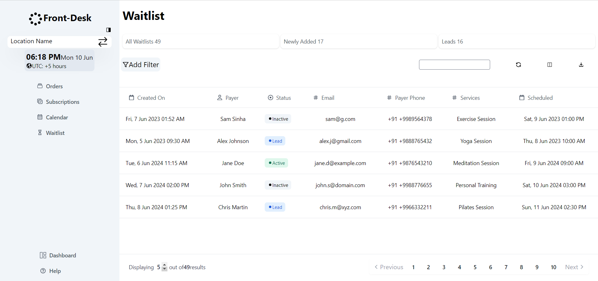
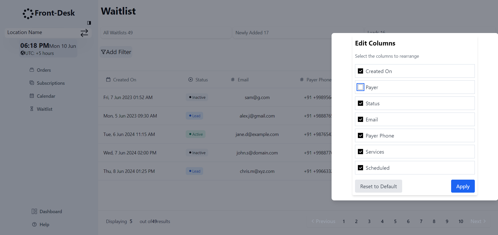
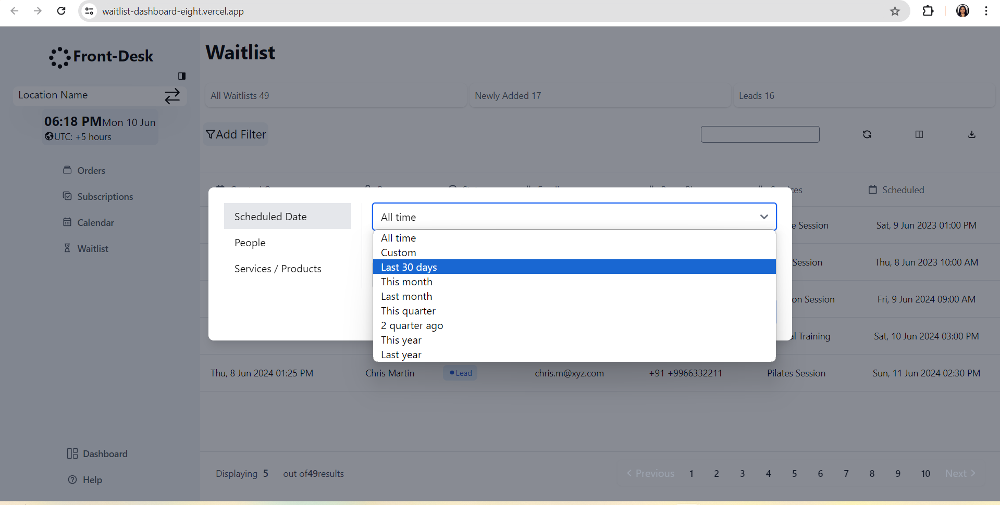
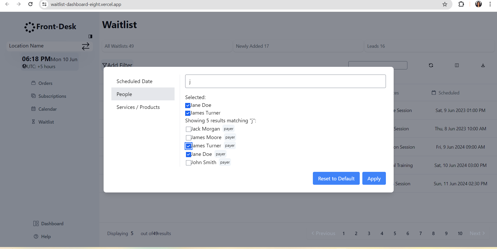
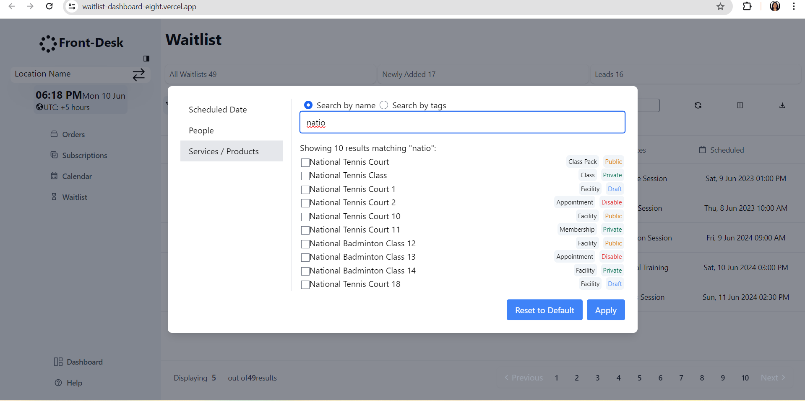
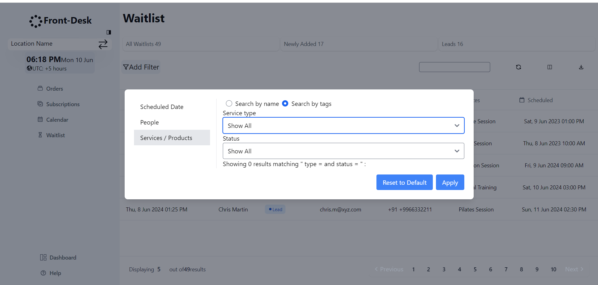

# Front-End Developer Assessment Project

## Introduction
This project is a part of the Front-End Developer assessment. The objective is to develop a web application based on the provided design mock-up using Next.js and Tailwind CSS. The project includes the implementation of various components such as summary boxes, filters, and tables. Additionally, interactivity features like a modal for filters are incorporated, along with subtle animations for scrolling and loading interactions to enhance the user experience.

## Project Type
Frontend

## Deployed App
Frontend: [Live Demo](https://waitlist-dashboard-eight.vercel.app/)

## Video Walkthrough of the Project

[Video Walkthrough](https://drive.google.com/file/d/1fuqOIrV_oycnCpX4caWbC9zMigpaow6P/view?usp=sharing)

## Features
**Tailwind CSS Implementation:** The project leverages Tailwind CSS for styling, ensuring rapid development and easy maintenance.

**Responsive Layout:** The layout is optimized for both mobile and desktop views, ensuring a seamless user experience across devices.

**Interactive Components:** Includes interactive elements such as summary boxes, filters with a modal, and smooth animations for enhanced user engagement.

**Data Pagination:** Implements pagination for efficiently managing large datasets and enhancing performance.

**Dynamic Content Rendering:** Dynamically renders content based on user-selected columns, providing flexibility and customization.

**Filters Implementation:** The project incorporates a modal for filters, allowing users to customize their view of the data. When users click the Filters Button, the modal opens, providing options to apply filters based on various criteria such as date, status, or any other relevant parameters. This feature enhances the user experience by enabling personalized data display and analysis.

## Design Decisions or Assumptions

**Tailwind CSS Selection:** Tailwind CSS is chosen for its utility-first approach, enabling quick prototyping and consistent styling across the application.
**Accessibility:** Accessibility considerations such as ARIA labels and keyboard navigation are integrated to enhance usability for all users.

## Installation & Getting Started
To run the project locally, follow these steps:

### Clone the repository

    git clone https://github.com/sarikasingh30/waitlist-dashboard.git
    

### Navigate to the project directory

    cd waitlist-dashboard

### Install dependencies
 
    npm install 

### Start the application

    npm run dev

## Usage

## Technology Stack

**Next.js:** Provides server-side rendering and routing capabilities for React applications.

**React.js:** A JavaScript library for building user interfaces.

**Tailwind CSS:** A utility-first CSS framework for rapidly building custom designs.

**React Datepicker:** Powerful and versatile date picker solution for React applications

---